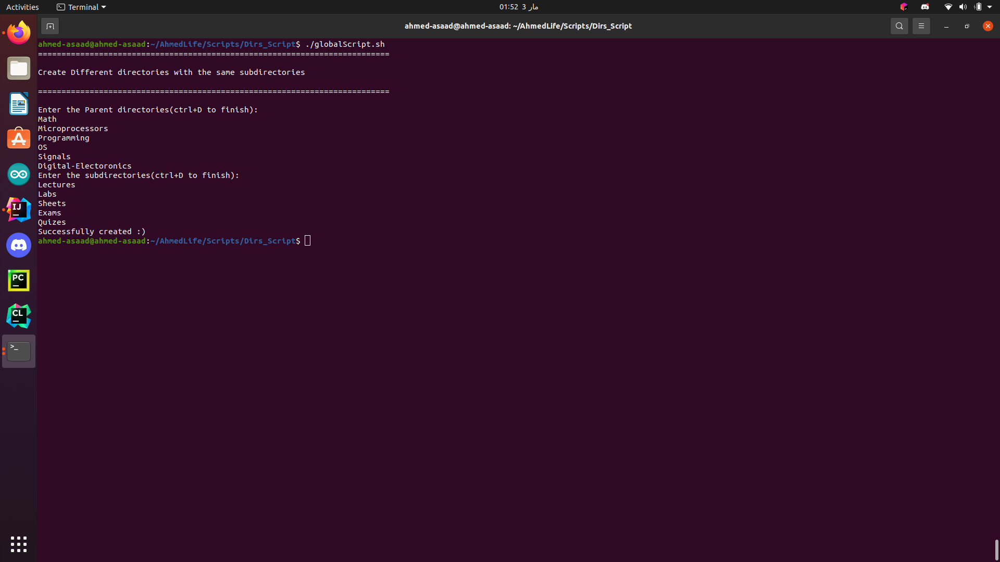
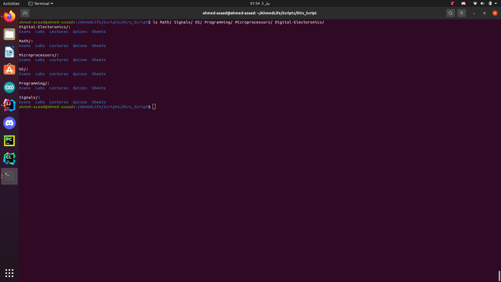

# Dirs_Script

## What does this script do?
> It is a simple script that **creates** any number of directories that have the same sub directories

## Examples
* 
* 

## Run
> chmod +x globalScript.sh

> ./globalScript.sh
